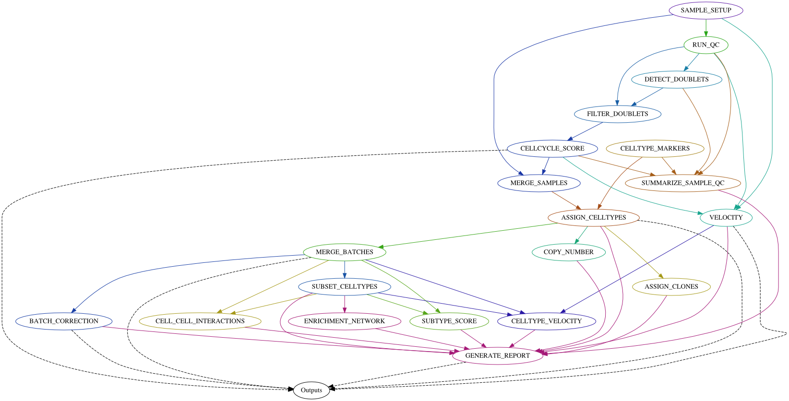

# Single Cell RNA-Seq Pipeline #


Pipeline for running single cell rna-seq analysis.




# Running with Docker #


```
docker run --mount type=bind,source=/datadrive/reference/,target=/reference  --mount type=bind,source=/datadrive/results/,target=/results  --mount type=bind,source=/datadrive/data/SCRNA10X_DH_CHIP0112_002,target=/data  --mount type=bind,source="/datadrive/runs/SCRNA10X_DH_CHIP0112_002",target=/runs  -w="/runs" -it nceglia/scrna-pipeline:devvm run_vm --sampleid SCRNA10X_DH_CHIP0112_002 --build GRCh38
```

